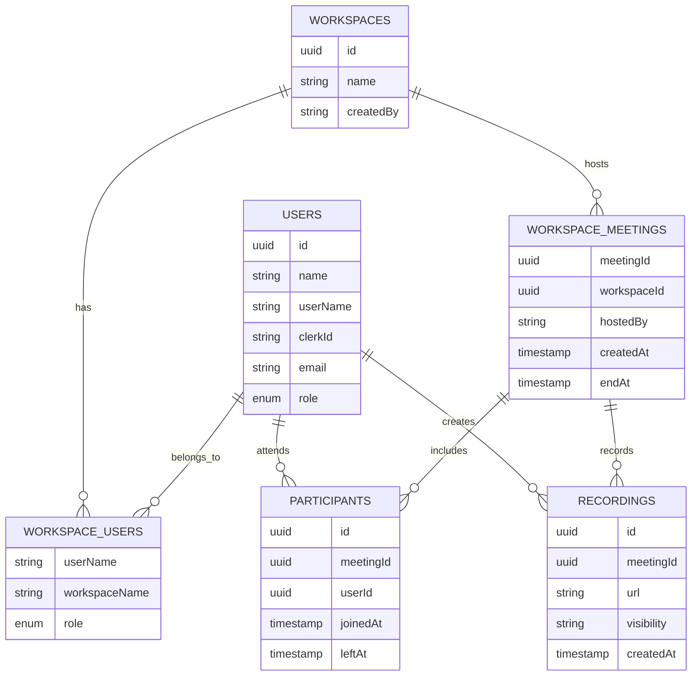

# Collaro 


<div align="center">

[](https://github.com/Priyanshux085/DevTalk/stargazers)
[](https://github.com/Priyanshux085/DevTalk/network/members)
[](https://github.com/Priyanshux085/DevTalk/issues)
[](https://github.com/Priyanshux085/DevTalk/blob/main/LICENSE)

</div>


A modern developer collaboration platform built for remote teams. Collaro seamlessly integrates real-time communication, live streaming, and structured meetings to enhance team productivity.

> 💡 **Want to see how it's built?** Check out my [**Technical Deep Dive**](./learn.md) where I share the challenges, solutions, and lessons learned building this platform with Next.js, Clerk, Stream, and PostgreSQL!


## Problem Statement

Collaro provides Team Leads a workspace-centric template to manage teams within a single organisation: create isolated workspaces for Sales, Development, Management, or Accounting; assign roles and permissions per workspace; schedule and host meetings with recordings; and share resources selectively across one or multiple workspaces — all with simple RBAC controls to keep cross-team access safe and auditable.

## Architecture (Mermaid)

Below is a high-level data-model diagram showing the main entities used by Collaro (Users, Workspaces, Memberships, Meetings, Participants, Recordings). This visualization maps directly to the database schema in `packages/database/drizzle/schema.ts`.



## Open Source Metrics & Guidelines

- **Primary metrics to track:** contributors, active contributors (last 90 days), stargazers, forks, open issues, PRs merged per month, and community response time. Aim targets (example): 10 active contributors in 6 months, <48h average initial response time to issues/PRs.
- **Labels & triage:** use `good first issue`, `help wanted`, `roadmap`, `security`, and `bug`. Tag newcomer-friendly issues to lower onboarding friction.
- **Maintainer SLA:** triage new issues within 48 hours, respond to PRs within 72 hours where possible.
- **Contribution recognition:** list active contributors in release notes and CONTRIBUTORS.md; highlight first-time contributors.
- **Sponsorship / Funding:** add a `FUNDING.yml` and GitHub Sponsors link when ready; consider GitHub Sponsors, Open Collective, or donation links.

If you'd like, I can add a small `metrics/` dashboard example or a `badges` snippet for the README.

## ✨ Key Features

- **Smart Workspaces**: Create and join dedicated team spaces with role-based access control.

- **Real-time Communication**: Engage in live discussions with integrated video and audio calls.


- **Live Streaming**: Stream your coding sessions or presentations directly to your team.

## 🛠️ Tech Stack

### Frontend Core
[](https://react.dev/)
[](https://nextjs.org/)
[](https://www.typescriptlang.org/)

### UI & Design
[](https://tailwindcss.com/)
[](https://www.radix-ui.com/)
[](https://lucide.dev/)

### State & Forms
[](https://zustand-demo.pmnd.rs/)
[](https://react-hook-form.com/)
[](https://zod.dev/)

### Communication
[](https://getstream.io/video/)

### Security
[](https://clerk.com/)

### Database
[](https://www.postgresql.org/)
[](https://orm.drizzle.team/)

### DevOps & Tools
[](https://eslint.org/)
[](https://prettier.io/)
[](https://typicode.github.io/husky/)
[](https://www.docker.com/)

## 🏁 Getting Started

### Prerequisites
- Node.js 18+ 
- Docker (optional)
- Git

### Quick Start 🚀

1. **Clone & Install**
```bash
git clone https://github.com/Coderx85/Collaro.git
cd Collaro
npm install
```

2. **Environment Setup 🔐**

1. Copy the example environment file:
```bash
cp .env.example .env.local
```

2. Update the following variables in `.env.local`:
- `NEXT_PUBLIC_CLERK_PUBLISHABLE_KEY`: Your Clerk public key
- `CLERK_SECRET_KEY`: Your Clerk secret key
- `STREAM_API_KEY`: Your Stream API key
- `STREAM_API_SECRET`: Your Stream secret key
- `DATABASE_URL`: Your PostgreSQL connection string
- `RESEND_API_KEY`: Your Resend API key

> **Note:** Never commit `.env` or `.env.local` files to the repository

3. **Development**
```bash
npm run dev     # Start with Turbopack
# or
docker compose up --build   # Start with Docker
```

Visit [http://localhost:3000](http://localhost:3000)
