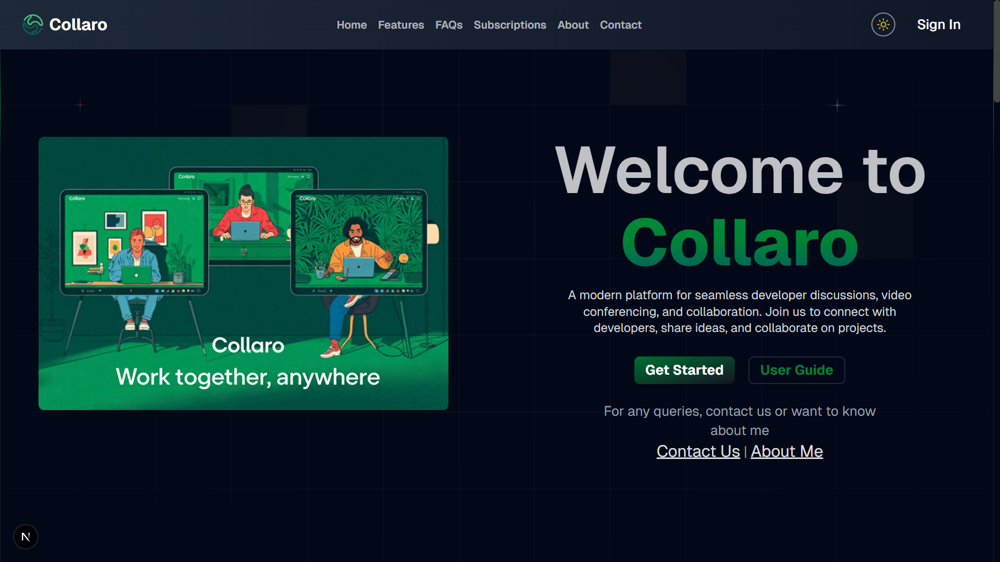

# Collaro 

A modern developer collaboration platform built for remote teams. Collaro seamlessly integrates real-time communication, live streaming, and structured meetings to enhance team productivity.

> 💡 **Want to see how it's built?** Check out my [**Technical Deep Dive**](./learn.md) where I share the challenges, solutions, and lessons learned building this platform with Next.js, Clerk, Stream, and PostgreSQL!

<div align="center">
  
</div>

## ✨ Key Features

<table>
  <tr>
    <td style="text-align: center;">
      
    </td>
    <td>
      <h3>Smart Workspaces</h3>
      <ul>
        <li>Create & join dedicated team spaces</li>
        <li>Role-Based Access Control (RBAC)</li>
        <li>Customizable workspace settings</li>
      </ul>
    </td>
  </tr>
  <tr>
    <td>
      
    </td>
    <td>
      <h3>Real-Time Communication</h3>
      <ul>
        <li>HD video meetings with screen sharing</li>
        <li>Live streaming for announcements</li>
        <li>Integrated chat during calls</li>
      </ul>
    </td>
  </tr>
  <tr>
    <td>
      
    </td>
    <td>
      <h3>GitHub Integration</h3>
      <ul>
        <li>Link discussions to repositories</li>
        <li>Review pull requests together</li>
        <li>Track issues in context</li>
      </ul>
    </td>
  </tr>
</table>

## 🛠️ Tech Stack

### Frontend Core
[](https://react.dev/)
[](https://nextjs.org/)
[](https://www.typescriptlang.org/)

### UI & Design
[](https://tailwindcss.com/)
[](https://www.radix-ui.com/)
[](https://lucide.dev/)

### State & Forms
[](https://zustand-demo.pmnd.rs/)
[](https://react-hook-form.com/)
[](https://zod.dev/)

### Communication
[](https://getstream.io/video/)

### Security
[](https://clerk.com/)

### Database
[](https://www.postgresql.org/)
[](https://orm.drizzle.team/)

### DevOps & Tools
[](https://eslint.org/)
[](https://prettier.io/)
[](https://typicode.github.io/husky/)
[](https://www.docker.com/)

## 🏁 Getting Started

### Prerequisites
- Node.js 18+ 
- Docker (optional)
- Git

### Quick Start 🚀

1. **Clone & Install**
```bash
git clone https://github.com/Coderx85/Collaro.git
cd Collaro
npm install
```

2. **Environment Setup 🔐**

1. Copy the example environment file:
```bash
cp .env.example .env.local
```

2. Update the following variables in `.env.local`:
- `NEXT_PUBLIC_CLERK_PUBLISHABLE_KEY`: Your Clerk public key
- `CLERK_SECRET_KEY`: Your Clerk secret key
- `STREAM_API_KEY`: Your Stream API key
- `STREAM_API_SECRET`: Your Stream secret key
- `DATABASE_URL`: Your PostgreSQL connection string
- `RESEND_API_KEY`: Your Resend API key

> **Note:** Never commit `.env` or `.env.local` files to the repository

3. **Development**
```bash
npm run dev     # Start with Turbopack
# or
docker compose up --build   # Start with Docker
```

Visit [http://localhost:3000](http://localhost:3000)