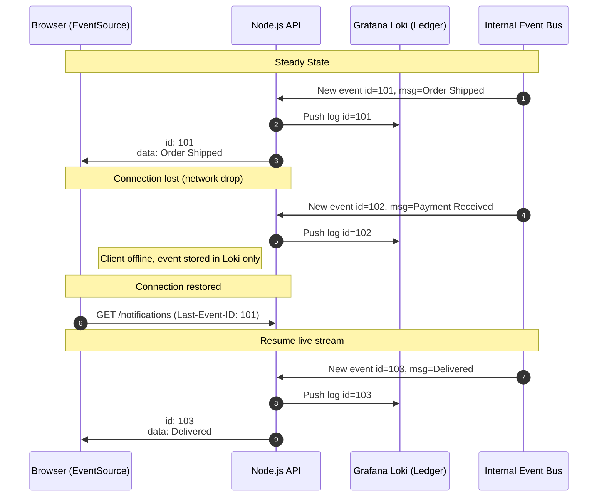

# Stream SDK Implementation Guide

This document outlines how the Stream Video SDK is integrated into the Collaro project for real-time video and audio communication.

## Packages Used

- `@stream-io/node-sdk`: Used on the server-side for secure actions like generating user tokens.
- `@stream-io/video-react-sdk`: The primary package for all client-side video functionality, including UI components and hooks.

---

## 1. Server-Side Authentication

To ensure that only authenticated users can join calls, a user token is generated on the server. This prevents the API secret from being exposed on the client.

### Token Provider

The `tokenProvider` function in `src/action/stream.actions.ts` is a Next.js Server Action responsible for this.

- It verifies the user's session.
- It uses the `StreamClient` from the `@stream-io/node-sdk` with the project's API key and secret.
- It generates a user token with a short expiration time (1 hour).

```typescript
// src/action/stream.actions.ts

"use server";

import { StreamClient } from "@stream-io/node-sdk";
import { headers } from "next/headers";
import { auth } from "@/lib/auth-config";

const STREAM_API_KEY = process.env.NEXT_PUBLIC_STREAM_API_KEY;
const STREAM_API_SECRET = process.env.STREAM_SECRET_KEY;

export const tokenProvider = async () => {
  const session = await auth.api.getSession({
    headers: await headers(),
  });

  if (!session?.user) throw new Error("User is not authenticated");
  if (!STREAM_API_KEY) throw new Error("Stream API key secret is missing");
  if (!STREAM_API_SECRET) throw new Error("Stream API secret is missing");

  const streamClient = new StreamClient(STREAM_API_KEY, STREAM_API_SECRET);

  const expirationTime = Math.floor(Date.now() / 1000) + 3600;
  const issuedAt = Math.floor(Date.now() / 1000) - 60;
  const token = streamClient.generateUserToken({
    user_id: session.user.id,
    exp: expirationTime,
    iat: issuedAt,
  });

  return token;
};
```

---

## 2. Client-Side Setup

The client-side is wrapped in a `StreamVideoProvider` to make the Stream client instance available throughout the React component tree.

### StreamClientProvider

The `StreamVideoProvider` in `src/providers/StreamClientProvider.tsx` initializes the `StreamVideoClient`.

- It waits for the user session to be loaded.
- It initializes `StreamVideoClient` with the public API key, the user's information, and the server-side `tokenProvider`.
- It wraps the application's children components with `<StreamVideo client={videoClient}>`.

```typescript
// src/providers/StreamClientProvider.tsx

"use client";

import { type ReactNode, useEffect, useState } from "react";
import { StreamVideoClient, StreamVideo } from "@stream-io/video-react-sdk";
import { useSession } from "@/lib/auth-client";
import { tokenProvider } from "@/action";
import Loader from "@/components/Loader";

const API_KEY = process.env.NEXT_PUBLIC_STREAM_API_KEY;

const StreamVideoProvider = ({ children }: { children: ReactNode }) => {
  const [videoClient, setVideoClient] = useState<StreamVideoClient>();
  const { data: session, isPending } = useSession();

  useEffect(() => {
    if (isPending || !session?.user) return;
    if (!API_KEY) throw new Error("Stream API key is missing");

    const client = new StreamVideoClient({
      apiKey: API_KEY,
      user: {
        id: session.user.id,
        name: session.user.userName || session.user.name || session.user.id,
        image: session.user.image || undefined,
      },
      tokenProvider,
    });

    setVideoClient(client);
  }, [session, isPending]);

  if (!videoClient) return <Loader />;

  return <StreamVideo client={videoClient}>{children}</StreamVideo>;
};

export default StreamVideoProvider;
```

This provider is used in the main dashboard layout (`src/app/(root)/(dashboard)/layout.tsx`) to ensure all dashboard pages have access to the Stream client.

---

## 3. Core Functionality

### Creating and Joining a Call

A new call can be created or joined using `client.call('default', callId)`. The `.getOrCreate()` method is used to either create a new call or get an existing one.

This pattern is used in the `PersonalRoom` component (`src/app/(root)/(dashboard)/workspace/[slug]/(members)/personal-room/page.tsx`).

```typescript
// src/app/(root)/(dashboard)/workspace/[slug]/(members)/personal-room/page.tsx

const startRoom = async () => {
  if (!client || !user) return;

  const newCall = client.call("default", meetingId!);

  if (!call) {
    await newCall.getOrCreate({
      data: {
        starts_at: new Date().toISOString(),
      },
    });
  }

  router.push(`/meeting/${meetingId}?personal=true`);
};
```

### Displaying the Meeting UI

The main meeting UI is handled by the `MeetingPage` component (`src/app/(root)/(dashboard)/meeting/[id]/page.tsx`).

- It fetches the call object using the `useGetCallById` hook.
- It wraps the UI in a `<StreamCall call={call}>` component, which provides the context for all other Stream components.
- `<StreamTheme>` provides default styling for the video components.
- It conditionally renders the `MeetingSetup` (pre-join screen) or `MeetingRoom` (the actual call) component.

```tsx
// src/app/(root)/(dashboard)/meeting/[id]/page.tsx

// ...
return (
  <main className="h-screen w-full">
    <StreamCall call={call}>
      <StreamTheme>
        {!isSetupComplete ? (
          <MeetingSetup setIsSetupComplete={setIsSetupComplete} />
        ) : (
          <MeetingRoom />
        )}
      </StreamTheme>
    </StreamCall>
  </main>
);
```

### In-Call UI Components

The `MeetingRoom` component (`src/components/workspace/meeting/MeetingRoom.tsx`) orchestrates the in-call experience using various components from the SDK:

- **`PaginatedGridLayout`**: A layout that shows all participants in a grid, with pagination.
- **`SpeakerLayout`**: A layout that features a dominant speaker with other participants in a sidebar.
- **`CallControls`**: Standard call controls (mic, camera, leave).
- **`CallParticipantsList`**: A list of participants in the call.
- **`CallStatsButton`**: A button to show call statistics.

The layout can be switched dynamically by the user.

---

This documentation provides a high-level overview. For more detailed information on specific components and hooks, refer to the official [Stream Video React SDK documentation](https://getstream.io/video/docs/react/).

## Features Implemented using Stream Client SDK

- Real-time video and audio communication between users, including support for multiple participants in a call.
- Dynamic switching between different video layouts (e.g., grid, speaker view) based on use case and user preference.
- Pre-call setup screen to allow users to configure their audio and video settings before joining a call
- In-call controls for muting/unmuting microphone, toggling camera, and leaving the call.
- Display of participant list and call statistics for better call management and troubleshooting.

### Learning from using this stream client SDK implementation

- [meeting](../src/components/workspace/meeting/): This directory contains the main components for the meeting experience, including the `MeetingPage`, `MeetingSetup`, and `MeetingRoom` components. It demonstrates how to use the Stream Video SDK to create a seamless video calling experience with dynamic layouts and in-call controls.

- meeting setup: The `MeetingSetup` component provides a pre-call setup screen where users can configure their audio and video settings before joining the call. This is a crucial step to ensure users have control over their media devices and can troubleshoot any issues before entering the call.

- [Stream SDK Action](../src/action/stream.actions.ts): This file contains the server-side action for generating user tokens securely. It demonstrates how to use the `@stream-io/node-sdk` to create a token provider that can be used on the client side without exposing sensitive information. This is an important aspect of implementing the Stream Video SDK, as it ensures that only authenticated users can join calls while keeping the API secret secure on the server.

- [Stream Client Provider](../src/providers/StreamClientProvider.tsx): This provider initializes the `StreamVideoClient` and makes it available throughout the React component tree. It demonstrates how to set up the client with user information and a token provider, ensuring that all components have access to the Stream client for making API calls and managing video calls effectively.


## Server-Sent Events (SSE) with Grafana Loki Ledger

This document outlines the architecture for a resilient notification service using **Node.js** for streaming and **Grafana Loki** as a persistent log ledger to handle reconnection sync.

### 1. System Architecture Diagram

The following sequence demonstrates how a client "catches up" on missed notifications after a network drop by querying the Loki ledger.

