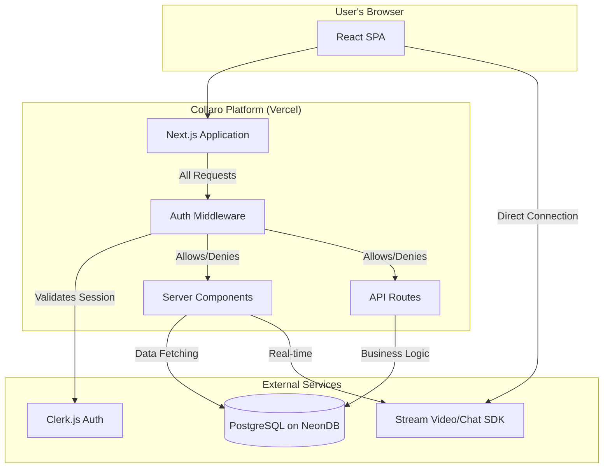
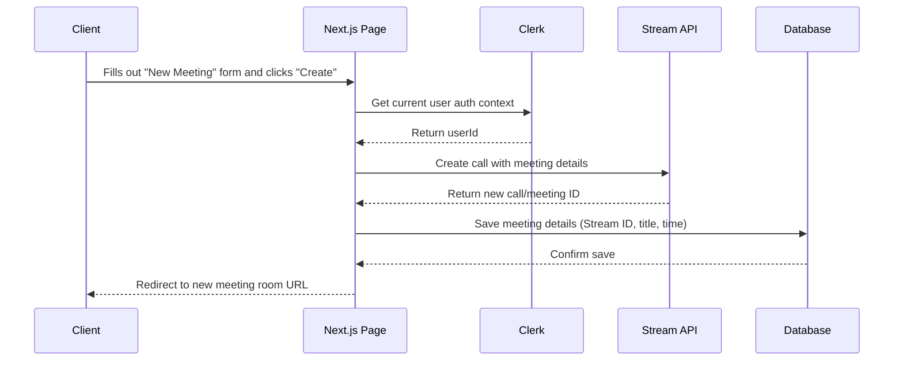
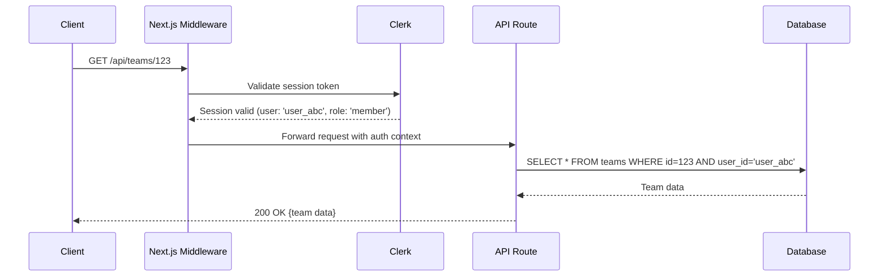

# Collaro: A Technical Deep Dive

Hey there! This is my technical journey building Collaro - the decisions, challenges, and solutions that shaped this collaboration platform.

---

### 1. Core Technical Vision & Strategic Goals

**Collaro** helps developers connect and collaborate in real-time. I wanted to build something fast, secure, and delightful to use.

These three core requirements shaped every technical decision I made throughout the project:

1.  **Real-Time Performance:** Video calls and live chat needed to feel instant. I chose Stream SDK for this.
2.  **Security First:** Protecting user data was non-negotiable. Clerk.js gave me enterprise-grade auth without the complexity.
3.  **Developer Happiness:** TypeScript and Drizzle ORM made coding enjoyable and caught bugs before users ever saw them.

These priorities led me to pick managed services for complex stuff while keeping full control over business logic.

---

### 2. Challenges Faced & Solutions Implemented

**Challenges Shortcuts:**
- [Implementing Granular RBAC with Clerk and Drizzle](#challenge-implementing-granular-rbac-with-clerk-and-drizzle)
- [Managing Real-Time State with Stream SDK in a Server Component World](#challenge-managing-real-time-state-with-stream-sdk-in-a-server-component-world)
- [Efficient Database Connection Pooling in a Serverless Environment](#challenge-efficient-database-connection-pooling-in-a-serverless-environment)

Here are the three biggest technical puzzles I solved while building Collaro.

#### **Challenge: Implementing Granular RBAC with Clerk and Drizzle**
*   **Problem:** I needed to connect Clerk's user authentication seamlessly with database permissions for secure data access.
*   **Initial Approach:** Passing user roles through every function call created messy, error-prone code everywhere.
*   **Breakthrough & Solution:** Used Next.js middleware as a centralized security layer that validates sessions and controls data access.

    1.  **Middleware Setup:** I created `src/middleware.ts` to protect routes using Clerk's `authMiddleware` for pages and API endpoints.
    2.  **Role Syncing:** Clerk Webhooks listen for `user.updated` events and trigger serverless functions to update our database.
    3.  **Query Authorization:** Service functions use Clerk's `auth()` helper to build permission-aware Drizzle queries for users.

    *Example: A simplified service function for fetching team data:*
    ```typescript
    // In src/lib/services/teamService.ts
    import { auth } from '@clerk/nextjs/server';
    import { db } from '@/db';
    import { teams, usersToTeams } from '@/db/schema';
    import { eq, and } from 'drizzle-orm';

    export async function getTeamForUser(teamId: string) {
      const { userId, orgRole } = auth();
      if (!userId) {
        throw new Error('Unauthorized');
      }

      // Admin can fetch any team
      if (orgRole === 'admin') {
        return await db.query.teams.findFirst({ where: eq(teams.id, teamId) });
      }

      // Regular members can only fetch teams they belong to
      const userTeamRelation = await db.query.usersToTeams.findFirst({
        where: and(eq(usersToTeams.userId, userId), eq(usersToTeams.teamId, teamId)),
      });

      if (!userTeamRelation) {
        throw new Error('Forbidden');
      }

      return await db.query.teams.findFirst({ where: eq(teams.id, teamId) });
    }
    ```
*   **Outcome:** Clean, centralized security where middleware handles authentication and services focus purely on business logic.

#### **Challenge: Managing Real-Time State with Stream SDK in a Server Component World**
*   **Problem:** Next.js loves Server Components, but real-time video needs persistent client-side WebSocket connections to Stream.
*   **Initial Approach:** Fetching Stream tokens in Server Components led to complex prop-drilling and lifecycle management nightmares.
*   **Breakthrough & Solution:** Created a StreamClientProvider that bridges server and client worlds using React Context patterns.

    1.  **Token Generation:** I created a server action (`src/action/stream.action.ts`) that generates time-limited Stream tokens for authenticated users.
    2.  **Client Provider:** The `StreamClientProvider` (`src/providers/StreamClientProvider.tsx`) is a Client Component that calls this server action.
    3.  **Context & Hooks:** It initializes the `StreamVideoClient` and provides it via context for components to access.

    ```typescript
    // src/providers/StreamClientProvider.tsx
    'use client';
    import { tokenProvider } from '@/action/stream.action';
    import { useUser } from '@clerk/nextjs';
    import { StreamVideo, StreamVideoClient } from '@stream-io/video-react-sdk';
    import { useEffect, useState } from 'react';

    const StreamVideoProvider = ({ children }) => {
      const [videoClient, setVideoClient] = useState();
      const { user, isLoaded } = useUser();

      useEffect(() => {
        if (!isLoaded || !user) return;
        const client = new StreamVideoClient({
          apiKey: process.env.NEXT_PUBLIC_STREAM_API_KEY,
          user: { id: user.id, name: user.username, image: user.imageUrl },
          tokenProvider, // Secure server action
        });
        setVideoClient(client);
      }, [user, isLoaded]);

      if (!videoClient) return <p>Loading...</p>;
      return <StreamVideo client={videoClient}>{children}</StreamVideo>;
    };
    export default StreamVideoProvider;
    ```
*   **Outcome:** Perfect separation of concerns - server handles tokens securely, client manages real-time state beautifully.

#### **Challenge: Efficient Database Connection Pooling in a Serverless Environment**
*   **Problem:** Vercel's serverless functions created new database connections constantly, quickly exhausting NeonDB's connection limits.
*   **Initial Approach:** Creating new Drizzle clients in each service function worked locally but failed miserably under load.
*   **Breakthrough & Solution:** Leveraged Node.js module caching by creating one global Drizzle client that gets reused.

    I created a single, global Drizzle client in `src/db/index.ts` that gets imported everywhere for connection reuse.
*   **Outcome:** Smart connection management that prevents resource exhaustion and keeps the app performant under load.

---

### 3. Lessons Learned & Future Considerations

1.  **Middleware Makes Everything Cleaner:** Putting auth and logging logic in one place kept our code organized and made testing much easier.
2.  **TypeScript Saves Time:** Setting up strong types early prevented countless bugs and made refactoring feel safe and predictable throughout development.
3.  **Use Great Tools:** Stream and Clerk handled complex features so we could focus on building what makes our platform special.
4.  **Global Instances Work:** Creating singleton database clients prevents connection issues and improves performance in serverless environments significantly.
5.  **Context is King:** React Context patterns elegantly solve state management problems between server and client component boundaries.
6.  **Security by Design:** Building authentication and authorization into the foundation saves countless hours of retrofitting security later.

**Future Considerations:**
*   **Refactoring:** Next time I'd create standardized Drizzle helper functions earlier to reduce RBAC boilerplate code.
*   **Scalability:** Redis caching for frequent queries and database sharding by organization for millions of users.

---

### 5. Visualizing Collaro's Architecture

<figure>
<figcaption><b>High-Level System Architecture:</b> This diagram shows the main components of Collaro and how they interact. The client (browser) communicates with the Next.js application, which orchestrates authentication, data, and real-time services.</figcaption>


</figure>

<figure>
<figcaption><b>Key Data Flow: Creating a Meeting</b></figcaption>


</figure>

<figure>
<figcaption><b>RBAC Enforcement Flow:</b> This sequence diagram illustrates how a user's role is checked when they attempt to access a protected resource.</figcaption>


</figure>
